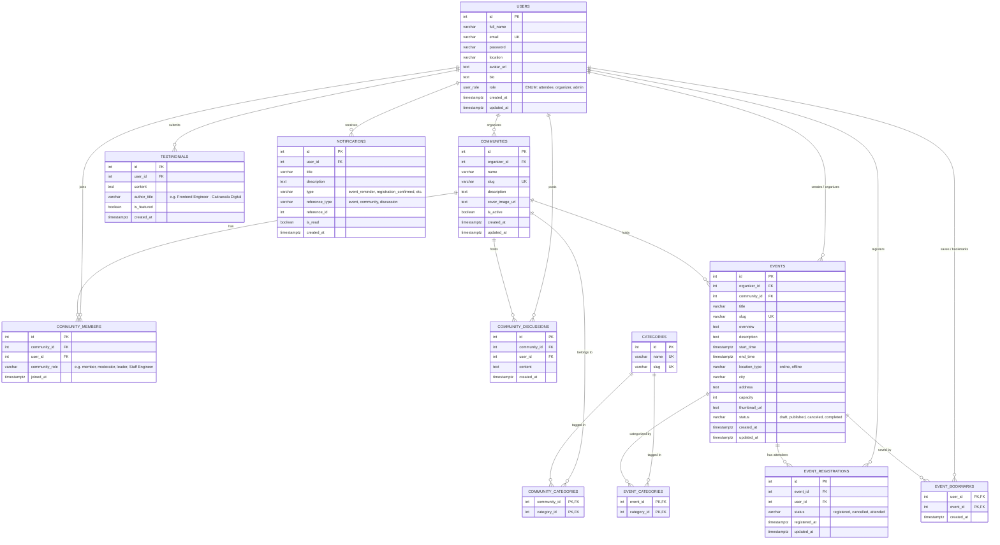
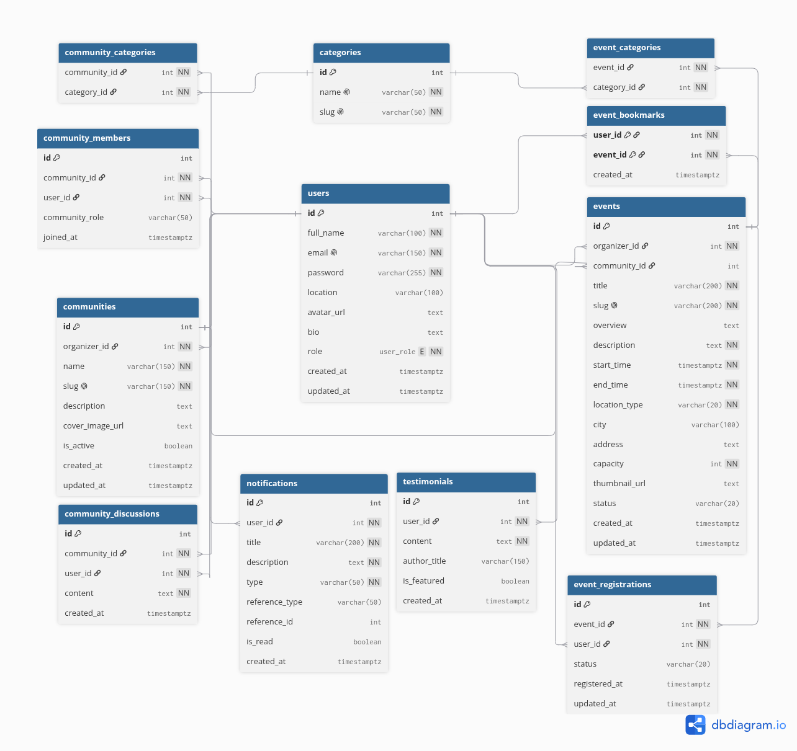

## 1. Database Entity Relationship Diagram (ERD)

### A. Format Mermaid

```mermaid
erDiagram
    USERS ||--o{ COMMUNITIES : "organizes"
    USERS ||--o{ COMMUNITY_MEMBERS : "joins"
    USERS ||--o{ COMMUNITY_DISCUSSIONS : "posts"
    USERS ||--o{ EVENTS : "creates / organizes"
    USERS ||--o{ EVENT_REGISTRATIONS : "registers"
    USERS ||--o{ EVENT_BOOKMARKS : "saves / bookmarks"
    USERS ||--o{ TESTIMONIALS : "submits"
    USERS ||--o{ NOTIFICATIONS : "receives"

    COMMUNITIES ||--o{ COMMUNITY_MEMBERS : "has"
    COMMUNITIES ||--o{ COMMUNITY_DISCUSSIONS : "hosts"
    COMMUNITIES ||--o{ EVENTS : "holds"
    COMMUNITIES ||--o{ COMMUNITY_CATEGORIES : "belongs to"

    CATEGORIES ||--o{ COMMUNITY_CATEGORIES : "tagged in"
    CATEGORIES ||--o{ EVENT_CATEGORIES : "tagged in"

    EVENTS ||--o{ EVENT_CATEGORIES : "categorized by"
    EVENTS ||--o{ EVENT_REGISTRATIONS : "has attendees"
    EVENTS ||--o{ EVENT_BOOKMARKS : "saved by"

    USERS {
        int id PK
        varchar full_name
        varchar email UK
        varchar password
        varchar location
        text avatar_url
        text bio
        user_role role "ENUM: attendee, organizer, admin"
        timestamptz created_at
        timestamptz updated_at
    }

    CATEGORIES {
        int id PK
        varchar name UK
        varchar slug UK
    }

    COMMUNITIES {
        int id PK
        int organizer_id FK
        varchar name
        varchar slug UK
        text description
        text cover_image_url
        boolean is_active
        timestamptz created_at
        timestamptz updated_at
    }

    COMMUNITY_CATEGORIES {
        int community_id PK,FK
        int category_id PK,FK
    }

    COMMUNITY_MEMBERS {
        int id PK
        int community_id FK
        int user_id FK
        varchar community_role "e.g. member, moderator, leader, Staff Engineer"
        timestamptz joined_at
    }

    COMMUNITY_DISCUSSIONS {
        int id PK
        int community_id FK
        int user_id FK
        text content
        timestamptz created_at
    }

    EVENTS {
        int id PK
        int organizer_id FK
        int community_id FK
        varchar title
        varchar slug UK
        text overview
        text description
        timestamptz start_time
        timestamptz end_time
        varchar location_type "online, offline"
        varchar city
        text address
        int capacity
        text thumbnail_url
        varchar status "draft, published, canceled, completed"
        timestamptz created_at
        timestamptz updated_at
    }

    EVENT_CATEGORIES {
        int event_id PK,FK
        int category_id PK,FK
    }

    EVENT_REGISTRATIONS {
        int id PK
        int event_id FK
        int user_id FK
        varchar status "registered, cancelled, attended"
        timestamptz registered_at
        timestamptz updated_at
    }

    EVENT_BOOKMARKS {
        int user_id PK,FK
        int event_id PK,FK
        timestamptz created_at
    }

    TESTIMONIALS {
        int id PK
        int user_id FK
        text content
        varchar author_title "e.g. Frontend Engineer · Cakrawala Digital"
        boolean is_featured
        timestamptz created_at
    }

    NOTIFICATIONS {
        int id PK
        int user_id FK
        varchar title
        text description
        varchar type "event_reminder, registration_confirmed, etc."
        varchar reference_type "event, community, discussion"
        int reference_id
        boolean is_read
        timestamptz created_at
    }
```

### B. Format DbDiagram (DBML)

https://dbdiagram.io/d/Event-hub-fix-695f243d09da44033d2a8385

